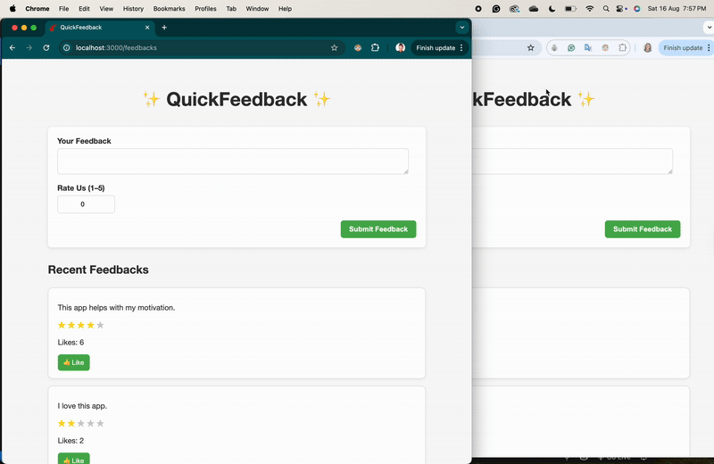

# QuickFeedback App

**QuickFeedback** is a real-time feedback app built with **Rails 7**, **Turbo/Hotwire**, and **StimulusJS**. Users can submit feedback, rate the service, and like feedbacks. All updates happen in real-time without page reloads.

## Features

- Submit feedback with **content** and **rating (1–5)**
- Real-time **likes** for each feedback
- Form validation with error messages
- Ratings displayed as **stars**
- Real-time updates using **Turbo Streams**
- Client-side behavior & animation using **StimulusJS**
- Flash messages for success or errors with dismiss button
- Clean and responsive UI with CSS styling

## App Demo


---



## Technologies

- Ruby 3.1+
- Rails 7.1+
- PostgreSQL
- Hotwire (Turbo + StimulusJS)
- RSpec & Capybara for testing
- CSS for styling

## Installation

1. Clone the repository:

```bash
git clone git@github.com:julie-ify/quick-feedback.git
cd quick-feedback
```

2. Install dependencies:

```bash
bundle install
```

3. Set up the database:

```bash
rails db:create
rails db:migrate
```

4. Start the development server:

```bash
rails server
```

Visit http://localhost:3000 to see the app in action.

## Usage

1. Open the homepage.
2. Submit a new feedback using the form.
3. Feedback appears under "Recent Feedbacks" in real-time.
4. Click `👍 Like` to like a feedback. Likes update instantly for all users.
5. Flash messages appear for success or errors and can be dismissed.

## Testing

Run all tests using RSpec:

```bash
bundle exec rspec spec
```

Tests cover:

- Model validations
- Controller actions
- Turbo Streams updates
- Feedback likes functionality

## Contributing

- Fork the repository
- Create a feature branch: git checkout -b feature-name
- Make your changes
- Run tests: bundle exec rspec
- Submit a Pull Request
